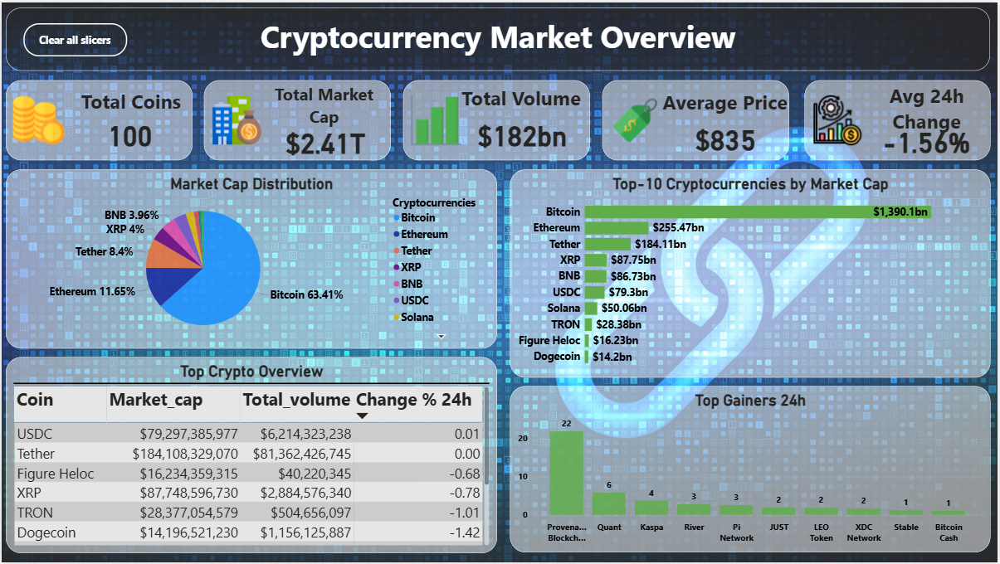
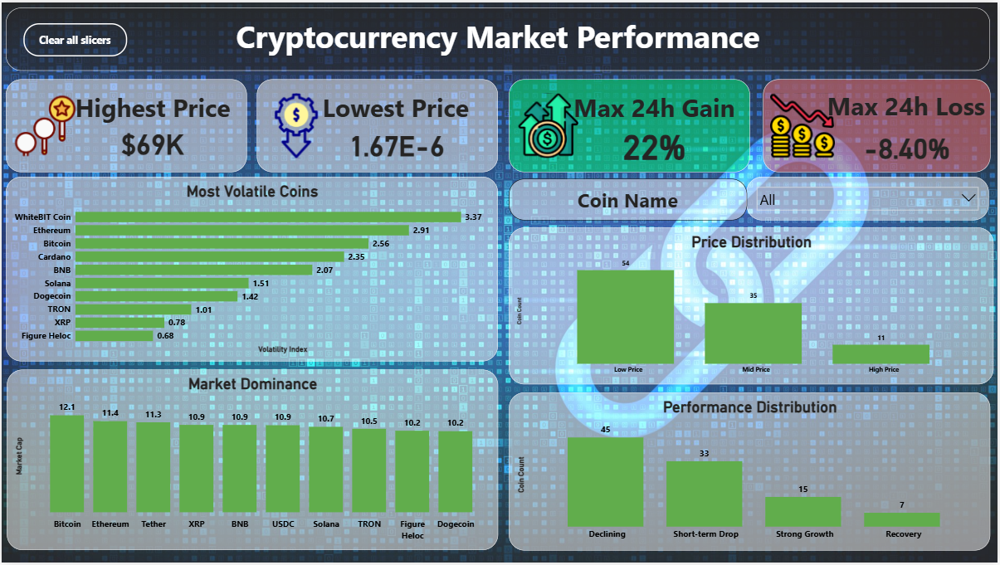
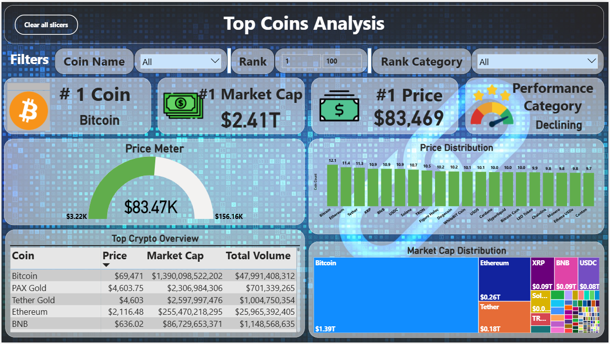
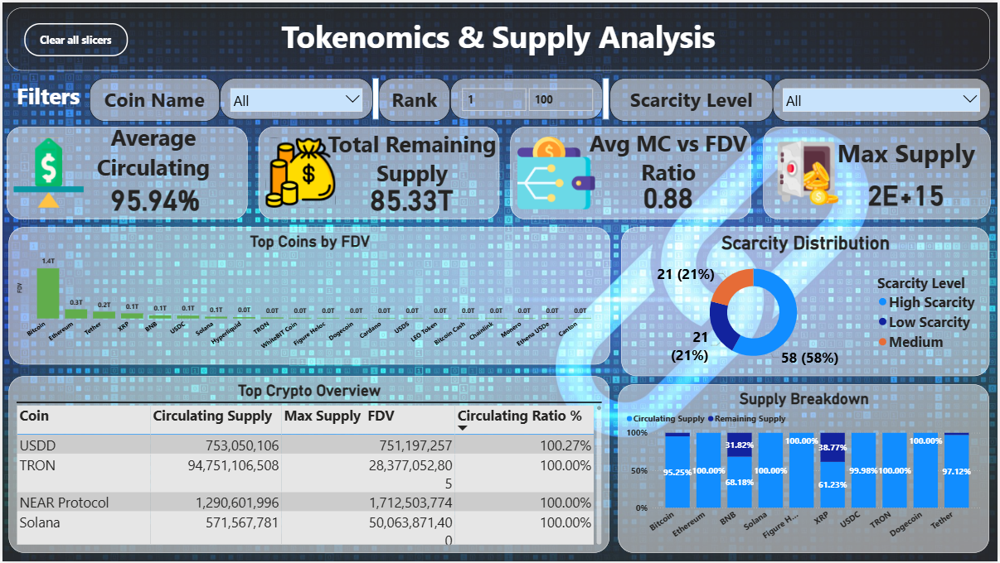
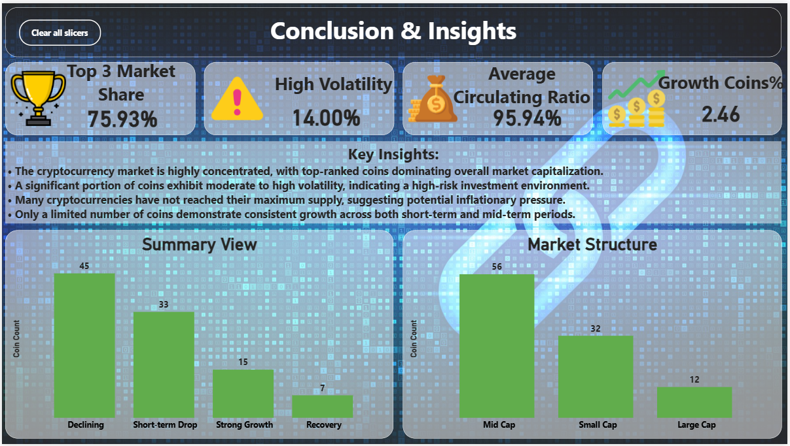

# 🚀 Cryptocurrency Market Analysis Dashboard  

> 📊 An end-to-end **Power BI project** analyzing cryptocurrency market trends, volatility, tokenomics, and performance using real-time API data.

---

## 🌟 Project Highlights

✨ Built using **real-world data (CoinGecko API)**  
📈 Interactive dashboards for deep market insights  
⚡ Advanced DAX calculations for analytics  
🎯 Focus on **market trends, risk, and investment insights**

---

## 🎯 Problem Statement

The cryptocurrency market is highly volatile and data-heavy, making it difficult to:
- Identify trends  
- Compare coins  
- Understand risk and performance  

👉 This project solves that by transforming raw data into **interactive, insight-driven dashboards**.

---

## 🧠 Key Objectives

- Analyze cryptocurrency market performance  
- Identify top-performing coins  
- Understand tokenomics and supply dynamics  
- Evaluate volatility and risk levels  

---

## 🏗️ Project Architecture

CoinGecko API → Power Query → Data Cleaning → Data Modeling (DAX) → Power BI Dashboard → Insights

---

## 📁 Dataset Overview

- 🌐 Source: CoinGecko API  
- 📊 Coverage: Top 100 Cryptocurrencies  
- 📌 Key Features:
  - Price  
  - Market Cap  
  - Trading Volume  
  - Circulating Supply  
  - Price Change (24h, 7d)  

---

## 🛠️ Tools & Technologies

| Tool | Purpose |
|------|--------|
| Power BI | Data Visualization |
| DAX | Calculations & Measures |
| Power Query | Data Transformation |
| API | Data Extraction |

---

## 📊 Dashboard Showcase

### 🟦 1. Overview Dashboard

---

### 🟦 2. Market Performance

---

### 🟦 3. Top Coins Analysis

---

### 🟦 4. Tokenomics Dashboard

---

### 🟦 5. Volatility Analysis

---

### 🟦 6. Insights Dashboard

---

## 📈 Key Insights

📌 Market is heavily dominated by top-ranked cryptocurrencies  
📌 Majority of coins exhibit **high volatility**  
📌 Many assets have **low circulating supply**, indicating inflation risk  
📌 Only a small percentage of coins show **consistent growth**

---

## 💡 Strategic Recommendations

✔ Focus on **large-cap cryptocurrencies** for stability  
✔ Monitor volatility before making investment decisions  
✔ Diversify portfolio across different market cap categories  
✔ Consider supply metrics for long-term investment  

---

## ⚙️ Advanced Features

🔥 Dynamic Top N analysis  
🔥 Volatility scoring system  
🔥 Market cap segmentation  
🔥 Interactive slicers & filters  

---

## 🚧 Challenges Faced

- Handling missing values (`max_supply`)  
- Managing extreme outliers in data  
- Designing clean and intuitive dashboards  

---

## 🔮 Future Improvements

- Real-time dashboard updates  
- Predictive analytics using ML  
- Integration with live trading signals  

---

## 📌 Conclusion

This project demonstrates the ability to:
- Transform raw API data into meaningful insights  
- Build interactive dashboards using Power BI  
- Apply analytical thinking to financial datasets  

---

## 👨‍💻 Author

**Parth Sharma**

---

## ⭐ If you found this project useful, consider giving it a star!